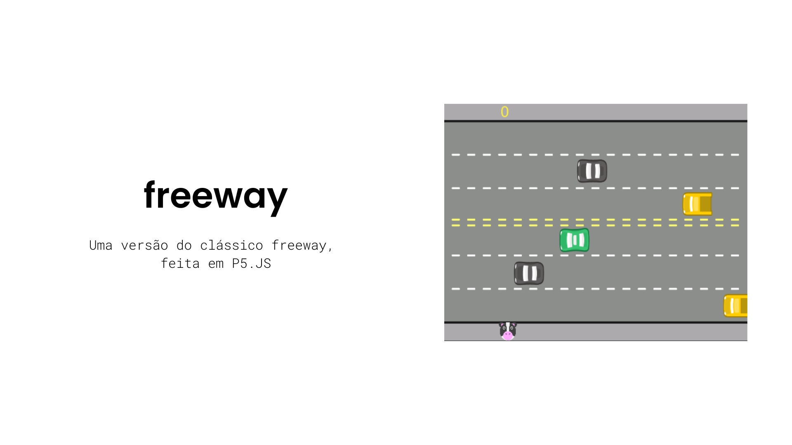

# Índice
* [Funcionalidades](#funcionalidades)
* [Uso](#uso)
* [Tecnologias](#tecnologias)
* [Como contribuir](#como-contribuir)
* [Autor](#autor)
* [Referencias](#referencias)
* [Licença](#licença)

# Funcionalidades
- **Pontuação:** sistema de pontuação
- **Som:** efeitos sonoros

# Uso
Apenas faça o download do código fonte, e depois execute em seu navegador, a partir do arquivo index.html

# Tecnologias

 

# Como contribuir
1. Faça um fork do projeto: https://github.com/jonathan-matheus/freeway 
2. Clone o seu fork para sua maquina: `git clone git@github.com:jonathan-matheus/freeway.git `
3. Crie uma branch para realizar sua modificação: `git checkout -b name_new_feature`
4. Adicione suas modificações e faça commit: `git commit -m "Descreva sua modificação"`
5. Push: `git push origin name_new_feature`
6. Crie um novo Pull Request
7. Pronto, agora só aguarde a análise

# Autor
| [ Jonathan Matheus](https://github.com/jonathan-matheus)
| :---: |

# Referencias
- [Alura](https://www.alura.com.br/)
- [Dev Icons](https://devicon.dev/)

# Licença
Projeto publicado em 2023 sobre licença [MIT](LICENSE.txt)
